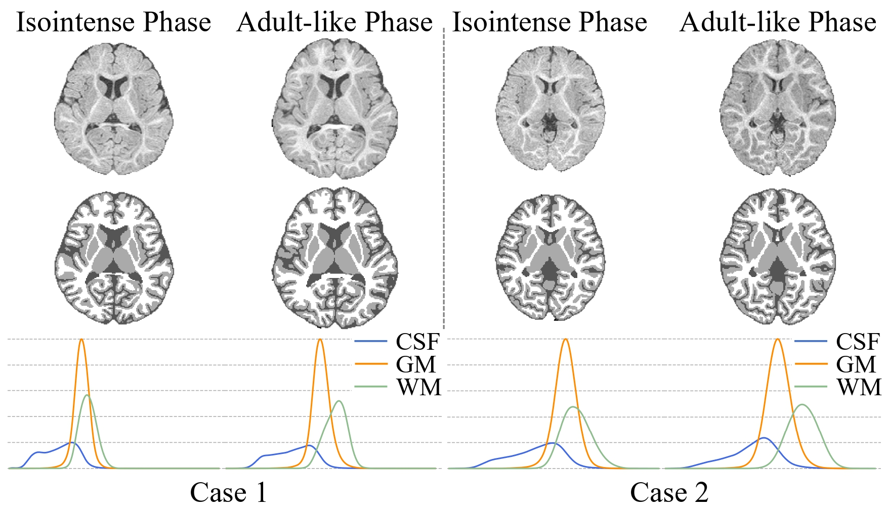
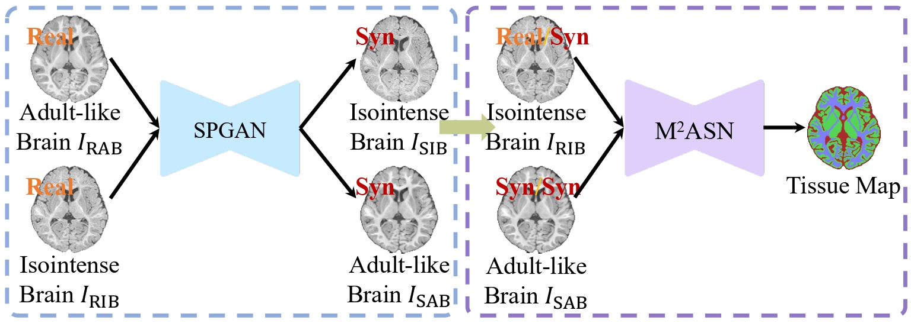
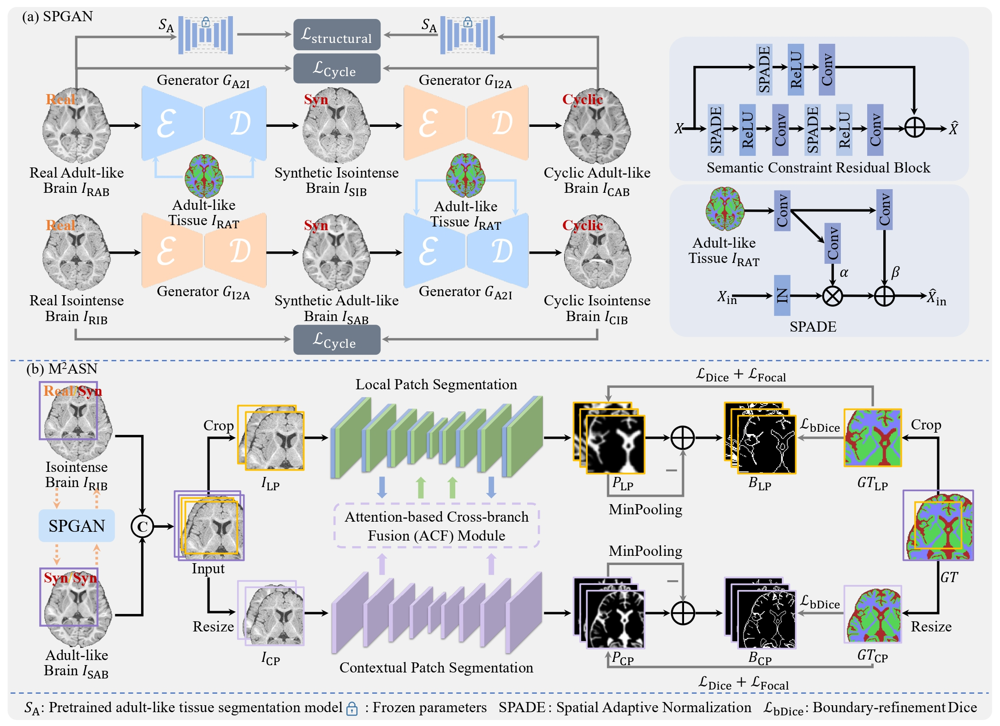

## Isointense Infant Brain Tissue Segmentation
***
Repo for isointense infant brain tissue segmentation

Author: Jiameng Liu

Contact: JiamengLiu.PRC@gmail.com

***
"Adult-like Phase and Multi-scale Assistance for Isointense Infant Brain Tissue Segmentation", [**_MICCAI_**](https://link.springer.com/chapter/10.1007/978-3-031-43901-8_6) 2023, [Jiameng Liu, Feihong Liu, Kaicong Sun, Mianxin Liu, Yuhang Sun, Yuyan Ge, and Dinggang Shen]

"Structure-aware Brain Tissue Segmentation for Isointense Infant MRI Data Using Multi-phase Multi-scale Assistance Network", [**_JBHI_**](https://ieeexplore.ieee.org/abstract/document/10684683), 2024, [Jiameng Liu, Feihong Liu, Dong Nie, Yuning Gu, Yuhang Sun, and Dinggang Shen]  

***

## Intensity distributions
Intensity distributions of GM and WM at isointense and adult-like phase T1w brain data

## Framework
Main framework of proposed structure-aware isointense brain tissue segmentation framework

Detailed illustration for MMASN 

## Usage

As the code is employed in other research projects, this repository has been populated solely with the compiled code and the pre-trained model, as referenced in our JBHI paper.

### Requirements

***

## [License ](./LICENSE)

Copyright (C) ShanghaiTech University.

All rights reserved. Licensed under the GPL (General Public License)

The code is released for academic research use only. For commercial use or business inquiries, please contact JiamengLiu.PRC@gmail.com
